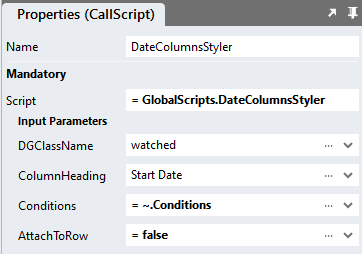
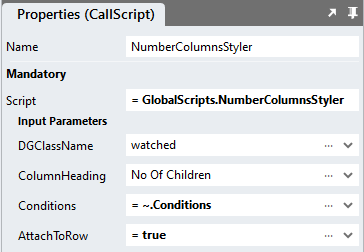
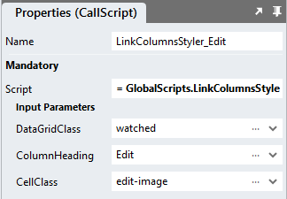

# Conditional Datagrid Styling
A sample that allows for styling datagrid rows or cells by cell content

https://github.com/stadium-software/conditional-datagrid-styling/assets/2085324/11af2f28-5fbe-46f1-9a47-2161984bf4ac

<hr>

## Change Log
1.1 Added a section on how to disable a link using this module

1.2 Enhanced script to include style attributes of attached classes in tr or tr tags directly

1.3 Added link column styler script

<hr>

## Contents

1. \\[Application Setup](#application-setup)
2. [Database, Connector and DataGrid](#database-connector-and-datagrid)
3. [Conditions Type](#conditions-type)
4. [CSS Styles](#css-styles)
5. [Global Scripts](#global-scripts)
6. [Page.Load Event Handler](#pageload-event-handlers)
7. [Supported Operators](#supported-operators)
8. [Disabling links](#disabling-links)

<hr>

## Application Setup
1. Check the *Enable Style Sheet* checkbox in the application properties

## Database, Connector and DataGrid

Use the instructions from [this repo](https://github.com/stadium-software/samples-database) to setup the database and DataGrids for this sample

<hr>

## Conditions Type

1. Add a new type by clicking the *Type* button in the top toolbar of the Stadium Designer
2. Name the type "Conditions"
3. Add two properties to the type as per the table below

| Property Name | Property Type |
| -------- | ------- |
| class | Any |
| conditions | List |


## CSS Styles
Paste the CSS below into the application *Stylesheet*

```
.subscribed {
	background-color: rgba(0, 77, 54, .5);
	color: white;
}
.unsubscribed {
	background-color: rgba(247, 42, 99, .5);
	color: white;
}
.no_data {
	background-color: rgba(214, 170, 86, .5);
}

.orange-bg {
	background-color: rgba(152, 237, 107, .5);
	color: black;
}
.grey-bg {
	background-color: rgba(209, 214, 86, .5);
}
.black-bg {
	background-color: rgba(0, 77, 54, .5);
	color: white;
}
.green-bg {
	background-color: rgba(86, 214, 112, .5);
	color: black;
}
.bold-font {
	font-weight: bold;
}
.yellow-bg {
	background-color: rgba(247, 223, 99, .5);
}

.edit-image button,
.edit-image button:hover {
	background-image: url('/src/assets/EmbeddedFiles/edit.png');
	background-repeat: no-repeat;
	background-size: 20px;
	background-position: left center;
	color: transparent;
}
.delete-image button,
.delete-image button:hover {
	background-image: url('/src/assets/EmbeddedFiles/delete.png');
	background-repeat: no-repeat;
	background-size: 20px;
	background-position: left center;
	color: transparent;
}

```

## Global Scripts

The sample caters for three data types

| Script name | 
| -------- | 
| [DateColumnsStyler](#DateColumnsStyler) | 
| [NumberColumnsStyler](#NumberColumnsStyler) |
| [TextColumnsStyler](#TextColumnsStyler) | 
| [LinkColumnsStyler](#LinkColumnsStyler) | 

<hr>

### DateColumnsStyler

1. Create a Global Script and call it DateColumnsStyler
2. Add the input parameters below to the script

<table><tr><th>Parameters</th><th>Notes</th></tr><tr><td>AttachToRow</td><td> A boolean</td></tr><tr><td>ColumnHeading</td><td>Headings might contain spaces</td></tr><tr><td>Conditions</td><td>A List of type *Conditions*</td></tr><tr><td>DataGridClass</td><td>Add this to the DataGrid (DG)</td></tr></table>

2. Drag a Javascript action into the script and paste the Javascript below unaltered into the action. You will see an error in the Validations Panel that says "Invalid script was detected". You can safely ignore this error. 
```
var columnHeading = ~.Parameters.Input.ColumnHeading;
var tableClassName = "." + ~.Parameters.Input.DataGridClass;
var data = ~.Parameters.Input.Conditions;
var attachtorow = ~.Parameters.Input.AttachToRow;

function styleRows() {
    let columnNumber = getColumnNumber(columnHeading);
    let arrPageRows = document.querySelectorAll(tableClassName + " tbody tr");
    let arrStyles = getAttributes();
    for (let i = 0; i < arrPageRows.length; i++) {
        let parentEl = arrPageRows[i];
        let cell = parentEl.querySelector("td:nth-child(" + columnNumber + ") div");
        if (cell) {
            for (let i = 0; i < data.length; i++) {
                parentEl.classList.remove(data[i].class);
                cell.parentElement.classList.remove(data[i].class);
                if (pass(cell.innerText, data[i].conditions)) {
                    attachClass(cell, parentEl, data[i].class, arrStyles);
                }
            }
        }
    }
}
function attachClass(td, tr, classname, styles) { 
    let ob = styles.find(o => o.name === classname);
    if (attachtorow) {
        tr.setAttribute("style", ob.styles);
    } else { 
        td.parentElement.setAttribute("style", ob.styles);
    }
}
function pass(celltext, conds) { 
    let conditionsString = "";
    let and = "";
    for (let i = 0; i < conds.length; i++) {
        conditionsString += and + "'" + celltext + "'" + conds[i];
        and = " && ";
    }
    let fn = new Function("return " + conditionsString);
    return fn();
}
function getColumnNumber(title) { 
    let arrHeadings = document.querySelectorAll(tableClassName + " thead th a");
    let colNo = 0;
    for (let i = 0; i < arrHeadings.length; i++) {
        if (arrHeadings[i].innerText.toLowerCase() == title.toLowerCase()) { 
            colNo = i + 1;
        }
    }
    return colNo;
}
function getClassAttributes(className) {
    let arrAttributes = [];
    let style = document.querySelectorAll("style");
    for (let i = 0; i < style.length; i++) { 
        let rules = style[i].sheet.cssRules;
        for (let i = 0; i < rules.length; i++) {
            let rule = rules[i];
            if (rule.selectorText == "." + className) { 
                arrAttributes = rule.cssText.replace("." + className,"").replace("{","").replace("}","");
            }
        }
    }
    return arrAttributes;
}
function getAttributes() { 
    let arrClassAttributes = [];
    for (let i = 0; i < data.length; i++) {
        if (!arrClassAttributes.includes(data[i].class)) {
            let className = data[i].class;
            let arrStyles = getClassAttributes(data[i].class);
            let obj = {"name":className, "styles":arrStyles};
            arrClassAttributes.push(obj);
        }
    }
    return arrClassAttributes;
}

var el = document.querySelector(tableClassName + " .table"),
options = {
    characterData: true,
    attributes: false,
    childList: true,
    subtree: true,
    characterDataOldValue: true,
},
observer = new MutationObserver(styleRows);
observer.observe(el, options);
```

### NumberColumnsStyler

1. Create a Global Script and call it NumberColumnsStyler
2. Add the input parameters below to the script

<table><tr><th>Parameters</th><th>Notes</th></tr><tr><td>AttachToRow</td><td> A boolean</td></tr><tr><td>ColumnHeading</td><td>Headings might contain spaces</td></tr><tr><td>Conditions</td><td>A List of type *Conditions*</td></tr><tr><td>DataGridClass</td><td>Add this to the DataGrid (DG)</td></tr></table>

2. Drag a Javascript action into the script and paste the Javascript below unaltered into the action. You will see an error in the Validations Panel that says "Invalid script was detected". You can safely ignore this error. 
```
var columnHeading = ~.Parameters.Input.ColumnHeading;
var tableClassName = "." + ~.Parameters.Input.DataGridClass;
var data = ~.Parameters.Input.Conditions;
var attachtorow = ~.Parameters.Input.AttachToRow;

function styleRows() {
    let columnNumber = getColumnNumber(columnHeading);
    let arrPageRows = document.querySelectorAll(tableClassName + " tbody tr");
    let arrStyles = getAttributes();
    for (let i = 0; i < arrPageRows.length; i++) {
        let parentEl = arrPageRows[i];
        let cell = parentEl.querySelector("td:nth-child(" + columnNumber + ") div");
        if (cell) {
            for (let i = 0; i < data.length; i++) {
                parentEl.classList.remove(data[i].class);
                cell.parentElement.classList.remove(data[i].class);
                if (pass(cell.innerText, data[i].conditions)) {
                    attachClass(cell, parentEl, data[i].class, arrStyles);
                }
            }
        }
    }
}
function attachClass(td, tr, classname, styles) { 
    let ob = styles.find(o => o.name === classname);
    console.log(styles.find(o => o.name === classname));
    if (attachtorow) {
        tr.setAttribute("style", ob.styles);
    } else { 
        td.parentElement.setAttribute("style", ob.styles);
    }
}
function pass(celltext, conds) { 
    celltext = parseFloat(celltext);
    let conditionsString = "";
    let and = "";
    for (let i = 0; i < conds.length; i++) {
        conditionsString += and + celltext + conds[i];
        and = " && ";
    }
    let fn = new Function("return " + conditionsString);
    return fn();
}
function getColumnNumber(title) { 
    let arrHeadings = document.querySelectorAll(tableClassName + " thead th a");
    let colNo = 0;
    for (let i = 0; i < arrHeadings.length; i++) {
        if (arrHeadings[i].innerText.toLowerCase() == title.toLowerCase()) { 
            colNo = i + 1;
        }
    }
    return colNo;
}

function getClassAttributes(className) {
    let arrAttributes = [];
    let style = document.querySelectorAll("style");
    for (let i = 0; i < style.length; i++) { 
        let rules = style[i].sheet.cssRules;
        for (let i = 0; i < rules.length; i++) {
            let rule = rules[i];
            if (rule.selectorText == "." + className) { 
                arrAttributes = rule.cssText.replace("." + className,"").replace("{","").replace("}","");
            }
        }
    }
    return arrAttributes;
}

function getAttributes() { 
    let arrClassAttributes = [];
    for (let i = 0; i < data.length; i++) {
        if (!arrClassAttributes.includes(data[i].class)) {
            let className = data[i].class;
            let arrStyles = getClassAttributes(data[i].class);
            let obj = {"name":className, "styles":arrStyles};
            arrClassAttributes.push(obj);
        }
    }
    return arrClassAttributes;
}

var el = document.querySelector(tableClassName + " .table"),
options = {
    characterData: true,
    attributes: false,
    childList: true,
    subtree: true,
    characterDataOldValue: true,
},
observer = new MutationObserver(styleRows);
observer.observe(el, options);
```

### TextColumnsStyler

1. Create a Global Script and call it TextColumnsStyler
2. Add the input parameters below to the script

<table><tr><th>Parameters</th><th>Notes</th></tr><tr><td>AttachToRow</td><td>A boolean</td></tr><tr><td>ColumnHeading</td><td>Headings might contain spaces</td></tr><tr><td>CellClassNames</td><td>A List of type *Any*</td></tr><tr><td>DataGridClass</td><td>Add this to the DataGrid (DG)</td></tr></table>

2. Drag a Javascript action into the script and paste the Javascript below unaltered into the action
```
var columnHeading = ~.Parameters.Input.ColumnHeading;
var tableClassName = "." + ~.Parameters.Input.DataGridClass;
var attachtorow = ~.Parameters.Input.AttachToRow;
var cellclassnames = ~.Parameters.Input.CellClassNames;

function styleRows() {
    let columnNumber = getColumnNumber(columnHeading);
    let arrPageRows = document.querySelectorAll(tableClassName + " tbody tr");
    let arrStyles = getAttributes();
    for (let i = 0; i < arrPageRows.length; i++) {
        let parentEl = arrPageRows[i];
        let cell = parentEl.querySelector("td:nth-child(" + columnNumber + ") div");
        for (let i = 0; i < cellclassnames.length; i++) {
            parentEl.classList.remove(cellclassnames[i]);
            cell.parentElement.classList.remove(cellclassnames[i]);
        }
    }
    for (let i = 0; i < arrPageRows.length; i++) {
        let parentEl = arrPageRows[i];
        let cell = parentEl.querySelector("td:nth-child(" + columnNumber + ") div");
        if (cell) {
            let cellText = cell.innerText.toLowerCase();
            attachClass(cell, parentEl, cellText.replace(" ","_"), arrStyles);
        }
    }
}
function attachClass(td, tr, classname, styles) { 
    let ob = styles.find(o => o.name === classname);
    if (attachtorow) {
        tr.setAttribute("style", ob.styles);
    } else { 
        td.parentElement.setAttribute("style", ob.styles);
    }
}
function getColumnNumber(title) { 
    let arrHeadings = document.querySelectorAll(tableClassName + " thead th a");
    let colNo = 0;
    for (let i = 0; i < arrHeadings.length; i++) {
        if (arrHeadings[i].innerText.toLowerCase() == title.toLowerCase()) { 
            colNo = i + 1;
        }
    }
    return colNo;
}
function getClassAttributes(className) {
    let arrAttributes = [];
    let style = document.querySelectorAll("style");
    for (let i = 0; i < style.length; i++) { 
        let rules = style[i].sheet.cssRules;
        for (let i = 0; i < rules.length; i++) {
            let rule = rules[i];
            if (rule.selectorText == "." + className) { 
                arrAttributes = rule.cssText.replace("." + className,"").replace("{","").replace("}","");
            }
        }
    }
    return arrAttributes;
}
function getAttributes() { 
    let arrClassAttributes = [];
    for (let i = 0; i < cellclassnames.length; i++) {
        if (!arrClassAttributes.includes(cellclassnames[i])) {
            let className = cellclassnames[i];
            let arrStyles = getClassAttributes(cellclassnames[i]);
            let obj = {"name":className, "styles":arrStyles};
            arrClassAttributes.push(obj);
        }
    }
    return arrClassAttributes;
}

var el = document.querySelector(tableClassName + " .table"),
options = {
    characterData: true,
    attributes: false,
    childList: true,
    subtree: true,
    characterDataOldValue: true,
},
observer = new MutationObserver(styleRows);
observer.observe(el, options);
```

### LinkColumnsStyler

1. Create a Global Script and call it LinkColumnsStyler
2. Add the input parameters below to the script

<table><tr><th>Parameters</th><th>Notes</th></tr><tr><td>ColumnHeading</td><td>Headings might contain spaces</td></tr><tr><td>CellClass</td><td>The name of the class to be attached to the cells</td></tr><tr><td>DataGridClass</td><td>Add this to the DataGrid (DG)</td></tr></table>

3. Drag a Javascript action into the script and paste the Javascript below unaltered into the action
```
let cellclassname = ~.Parameters.Input.CellClass;
let dgClassName = "." + ~.Parameters.Input.DataGridClass;
let dg = document.querySelector(dgClassName);
let table = dg.querySelector("table");
let columnHeading = ~.Parameters.Input.ColumnHeading;
let columnNumber = getColumnNumber(columnHeading);
let options = {
    characterData: true,
    attributes: false,
    childList: true,
    subtree: true,
    characterDataOldValue: true,
}, observer = new MutationObserver(attachStyle);
observer.observe(table, options);

function attachStyle() {
    let arrDGCells = table.querySelectorAll("tbody tr td:nth-child(" + columnNumber + ")");
    for (let i = 0; i < arrDGCells.length; i++) {
        arrDGCells[i].classList.add(cellclassname);
    }
}
function getColumnNumber(title) { 
    let arrHeadings = table.querySelectorAll("thead th a");
    let colNo = 0;
    for (let i = 0; i < arrHeadings.length; i++) {
        if (arrHeadings[i].innerText.toLowerCase() == title.toLowerCase()) { 
            colNo = i + 1;
        }
    }
    return colNo;
}
```

<hr>

## Page.Load Event Handlers

In order to apply styles to a DataGrid row or column, script that corresponds with the column data type must be executed in the Page.Load event handler of the page where you added the DataGrid above

### Date Columns

1. Add a List of type *Conditions* as the FIRST item in the event handler (it MUST be the first item in the script!!!)
2. Open the *Items Editor* on the *Value* property
   1. Add the name of a CSS class (e.g. black-bg)
   2. Open the *Items Editor* on the *conditions* property
      1. Enter the first condition (e.g. ">='2020/01/01'" for greater than or equals to first of Jan 2020)
      2. Enter a second condition (e.g. "<'2021/01/01'" for smaller than Jan first 2021)
   3. All dates MUST be enclosed in single quotes
   4. All conditions will be chained using *&&* operators (AND)
   5. Check out the [supported Javascript comparison operators](#supported-operators)

*Conditions Value Property Example*
```
= [{
 "class": "yellow-bg",
 "conditions": [">='2022/01/01'","<'2022/10/01'"]
},{
 "class": "black-bg",
 "conditions": [">='2022/10/01'","<'2023/01/01'"]
},{
 "class": "green-bg",
 "conditions": [">='2023/01/01'","<'2024/01/01'"]
}]
```

https://github.com/stadium-software/conditional-datagrid-styling/assets/2085324/c53c6b7e-c9f6-40dd-9a0a-b6d97d56c3e4

1. Drag the DateColumnsStyler script directly under the List of Conditions
2. Provide the input parameters as per the table below

| Parameter | Value | Note |
|---------|-------------|-------------------|
| DataGridClass | *watched* | This must be the class name you assigned to the DataGrid |
| Column Heading | Copy the heading from the DataGrid or the 'Header Text' property of the DataGrid column | Column headings might contain spaces that your database column does not contain |
| Conditions | The above mentioned list of conditions | |
| AttachToRow | =true or =false | A boolean to indicate if the row or cell will be styled |



5. Drag in the query and a SetValue to populate the DataGrid as per usual

### Number Columns

1. Add a List of type *Conditions* as the FIRST item in the event handler (it MUST be the first item in the script!!!)
2. Open the *Items Editor* on the *Value* property
   1. Add the name of a CSS class (e.g. black-bg)
   2. Open the *Items Editor* on the *conditions* property
      1. Enter the first condition (e.g. ">0" for greater than 0)
      2. Enter a second condition (e.g. "<6" for smaller than 6)
   3. All conditions will be chained using *&&* operators (AND)
   4. Check out the [supported Javascript comparison operators](#Supported-Operators)

*Conditions Value Property Example*
```
= [{
	"class": "orange-bg",
	"conditions": ["<2",">0"]
},{
	"class": "yellow-bg",
	"conditions": ["==2"]
},{
	"class": "black-bg",
	"conditions": [">2","<8"]
},{
	"class": "green-bg",
	"conditions": ["> 7"]
},{
	"class": "link-col",
	"conditions": ["==0"]
}]
```

https://github.com/stadium-software/conditional-datagrid-styling/assets/2085324/cf85c290-e3a0-4b83-b6d7-1da25796d443

3. Drag the NumberColumnsStyler script directly under the List of Conditions
4. Provide the input parameters as per the table below

| Parameter | Value | Note |
|---------|-------------|-------------------|
| DataGridClass | *watched* | This must be the class name you assigned to the DataGrid |
| Column Heading | Copy the heading from the DataGrid or the 'Header Text' property of the DataGrid column | Column headings might contain spaces that your database column does not contain |
| Conditions | The above mentioned list of conditions | |
| AttachToRow | =true or =false | A boolean to indicate if the row or cell will be styled |



5. Drag in the query and SetValue to populate the DataGrid as per usual

### Text Columns

Text columns are styled by adding CSS classes to the stylesheet that correspond with the values in the datagrid.

Some examples:

| Column Text | CSS Class | Stylesheet |
|--------|-----------|------------|
| Meat Products | meat_products | .meat_products { color: red; } |
| Dairy Products | dairy_products |.dairy_products { color: yellow; } |
| Seafood and Fish | seafood_and_fish | .seafood_and_fish { color: blue; } |

1. Add a List of type *Any* as the FIRST item in the event handler (it MUST be the first item in the script!!!)
2. Open the *Items Editor* on the *Value* property
   1. Add the names of all CSS classes you have added to your stylesheet
   2. All classes must have a corresponding value in the datagrid
   3. All values MUST be lowercase
   4. Spaces in the datagrid value must be replaced with underscores

*CellClassNames Value Property Example*
```
= ["no_data","subscribed","unsubscribed"]
```

https://github.com/stadium-software/conditional-datagrid-styling/assets/2085324/bd8e057f-40f6-429d-9577-603438c63d3a

3. Drag the TextColumnsStyler script directly under the List 
4. Provide the input parameters as per the table below

| Parameter | Value | Note |
|---------|-------------|---------|
| DataGridClass | *watched* | This must be the class name you assigned to the DataGrid |
| Column Heading | Copy the heading from the DataGrid or the 'Header Text' property of the DataGrid column | Column headings might contain spaces that your database column does not contain |
| CellClassNames | The above mentioned list of class names | |
| AttachToRow | =true or =false | A boolean to indicate if the row or cell will be styled |


5. Drag in the query and SetValue to populate the DataGrid as per usual

### Link Columns

Link columns are styled by adding CSS classes to the stylesheet that correspond with the values in the ClassName parameter of the LinkColumnStyler script.

1. For every link column you want to style, drag the LinkColumnsStyler script into the Page.Load
2. Enter the Input parameters
   1. DataGridClass: The class name you assigned to your DataGrid
   2. ColumHeading: The heading of the column you wish to style
   3. CellClass: The name of the class that should be attached to each cell



## Supported Operators

| Operator | Description |
|--------|----------|
| == | equals |
| != | not equal |
| > | greater than |
| < | less than |
| >= | greater than or equal to |
| <= | less than or equal to |

## Disabling links
If you want to use a condition to decide whether the user should see a link to another page or not, do this

1. Create your conditions as above
2. Attach the class to the row (AttachToRow = true)
3. Use any of CSS below to manipulate the link column 

The examples assume the class you attach is called *link-col* and the link is in the first column of your DataGrid.

```
.link-col td:nth-child(1) button {
    /*Disable the click event*/
    pointer-events: none;

    /*Make it gray*/
    color: grey;

    /*Remove the underline*/
    text-decoration: none;
}
```

```
.link-col td:nth-child(1) button {
    /*Hide the link away*/
    display: none;
}
.link-col td:nth-child(1) div:after {
    /*Add a pseudo class to the cell and write any text you like (try "\26D4" https://www.w3schools.com/cssref/css_entities.php)*/
    content: "Disabled";
}
```
