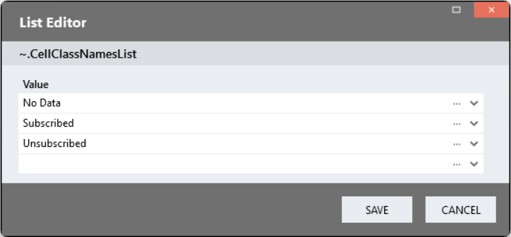
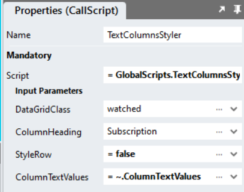

# Conditional Datagrid Styling

A sample that shows how to style datagrid rows or cells according to the values found in cells. The sample supports text, date, number and link columns. 

https://github.com/stadium-software/conditional-datagrid-styling/assets/2085324/11af2f28-5fbe-46f1-9a47-2161984bf4ac

## Change Log
1.1 Added a section on how to disable a link using this module

1.2 Enhanced script to include style attributes of attached classes in tr or tr tags directly

1.3 Added link column styler script. Optimised scripts. Styles no longer injected.

## Contents

- [Conditional Datagrid Styling](#conditional-datagrid-styling)
  - [Change Log](#change-log)
  - [Contents](#contents)
  - [Application Setup](#application-setup)
  - [Database, Connector and DataGrid](#database-connector-and-datagrid)
  - [Text Columns](#text-columns)
    - [Text Column Global Script](#text-column-global-script)
    - [Text Column Page Setup](#text-column-page-setup)
    - [Text Column Page.Load Event Handler Setup](#text-column-pageload-event-handler-setup)
    - [Text Column Stylesheet](#text-column-stylesheet)
  - [Number Columns](#number-columns)
    - [Number Column Global Script](#number-column-global-script)
    - [Number Column Page Setup](#number-column-page-setup)
    - [Conditions Type](#conditions-type)
    - [Number Column Page.Load Event Setup](#number-column-pageload-event-setup)
    - [Number Column Stylesheet](#number-column-stylesheet)
  - [Date Columns](#date-columns)
    - [Date Column Global Script](#date-column-global-script)
    - [Date Column Page Setup](#date-column-page-setup)
    - [Conditions Type](#conditions-type-1)
    - [Date Column Page.Load Event Setup](#date-column-pageload-event-setup)
    - [Date Column Stylesheet](#date-column-stylesheet)
  - [Link Columns](#link-columns)
    - [Link Column Global Script](#link-column-global-script)
    - [Link Column Page Setup](#link-column-page-setup)
    - [Link Column Page.Load Event Handler Setup](#link-column-pageload-event-handler-setup)
    - [Link Column Stylesheet](#link-column-stylesheet)
  - [Disabling Links](#disabling-links)
  - [Supported Operators](#supported-operators)

## Application Setup
Check the *Enable Style Sheet* checkbox in the application properties

## Database, Connector and DataGrid

Use the instructions from [this repo](https://github.com/stadium-software/samples-database) to setup the database and DataGrids for this sample

## Text Columns

How to style the cells or row by the text found in a specific column

### Text Column Global Script

1. Create a Global Script and call it "TextColumnsStyler"
2. Add the input parameters below to the script
   1. ColumnTextValues
   2. ColumnHeading
   3. DataGridClass
   4. StyleRow
3. Drag a Javascript action into the script and paste the Javascript below unaltered into the action
```
let columnHeading = ~.Parameters.Input.ColumnHeading;
let dgClass = "." + ~.Parameters.Input.DataGridClass;
let table = document.querySelector(dgClass + " table");
table.classList.add("datagrid-custom-column-styling");
let attachtorow = ~.Parameters.Input.StyleRow;
var cellclassnames = ~.Parameters.Input.ColumnTextValues;
let columnNumber = getColumnNumber(columnHeading);
let classes = [];
for (let i = 0; i < cellclassnames.length; i++) { 
    classes.push(cellclassnames[i].toLowerCase().replace(" ", "_"));
}
let selectorsList = '.' + classes.join(",.");

function styleRows() {
    removeAllClasses();
    let arrTableCells = table.querySelectorAll("tbody tr td:nth-child(" + columnNumber + ") div");
    for (let i = 0; i < arrTableCells.length; i++) {
        let cell = arrTableCells[i];
        if (cell) {
            let cellText = cell.innerText.toLowerCase().replace(" ","_");
            attachClass(cell, cellText);
        }
    }
}
function attachClass(td, classname) { 
    let tr = td.closest("tr");
    if (attachtorow) {
        let cells = tr.cells;
        for (let i = 0; i < cells.length; i++) {
            cells[i].classList.add(classname);
        }
    } else { 
        td.parentElement.classList.add(classname);
    }
}
function removeAllClasses() { 
    let arrClassCells = table.querySelectorAll(selectorsList);
    for (let i = 0; i < arrClassCells.length; i++) { 
        let ob = arrClassCells[i];
        for (let i = 0; i < classes.length; i++) { 
            ob.classList.remove(classes[i]);
        }
    }
}
function getColumnNumber(title) { 
    let arrHeadings = table.querySelectorAll("thead th a");
    let colNo = 0;
    for (let i = 0; i < arrHeadings.length; i++) {
        if (arrHeadings[i].innerText.toLowerCase() == title.toLowerCase()) { 
            colNo = i + 1;
        }
    }
    return colNo;
}

let options = {
    characterData: true,
    attributes: false,
    childList: true,
    subtree: true,
    characterDataOldValue: true,
},
observer = new MutationObserver(styleRows);
observer.observe(table, options);
```

### Text Column Page Setup

1. Drag a *DataGrid* control to the page (if you don't already have one)
2. Add a class to identify the DataGrid *Classes* property (e.g. watched)

### Text Column Page.Load Event Handler Setup

1. Drag a *List* action into the script
2. Leave the *Item Type* property of the List as "Any"
3. Open the *Items Editor* on the List *Value* property
4. Add the text values you want to use to style the cell or row



5. Drag the *TextColumnsStyler* script under the list
6. Provide the input parameters for the script
   1. DataGridClass: The classname you assigned to your DataGrid
   2. Column Heading: The heading of the column that contains the text values (with spaces)
   3. StyleRow: Enter *true* if you want the entire row to be styled. By default only the cell is styled
   4. ColumnTextValues: The List of text values
7. Populate the DataGrid with data



### Text Column Stylesheet

Each text value you wish to find requires a corresponding CSS class in the Stylesheet. When the script above runs, it matches the class name to the cell containing the corresponding text value. 

Rules

1. All CSS classnames must be lower case
2. Replace spaces in text values with underscores

Example:
```
.no_data {
    background-color: rgba(214, 170, 86, .5);
}
.subscribed {
    background-color: rgba(0, 77, 54, .5);
    color: white;
}
.unsubscribed {
    background-color: rgba(247, 42, 99, .5);
    color: white;
}
```

## Number Columns 

How to style the cells or row by the number values found in a specific column

### Number Column Global Script

1. Create a Global Script and call it "NumberColumnsStyler"
2. Add the input parameters below to the script
   1. ColumnHeading
   2. Conditions
   3. DataGridClass
   4. StyleRow
3. Drag a Javascript action into the script and paste the Javascript below unaltered into the action
```
let columnHeading = ~.Parameters.Input.ColumnHeading;
let dgClass = "." + ~.Parameters.Input.DataGridClass;
let table = document.querySelector(dgClass + " table");
table.classList.add("datagrid-custom-column-styling");
let data = ~.Parameters.Input.Conditions;
let attachtorow = ~.Parameters.Input.StyleRow;
let columnNumber = getColumnNumber(columnHeading);
let classes = [];
for (let i = 0; i < data.length; i++) { 
    classes.push(data[i].class);
}
let selectorsList = '.' + classes.join(",.");

function styleRows() {
    removeAllClasses();
    let arrTableCells = table.querySelectorAll("tbody tr td:nth-child(" + columnNumber + ") div");
    for (let i = 0; i < arrTableCells.length; i++) {
        let cell = arrTableCells[i];
        if (cell) {
            for (let i = 0; i < data.length; i++) {
                if (pass(cell.innerText, data[i].conditions)) {
                    attachClass(cell, data[i].class);
                }
            }
        }
    }
}
function attachClass(td, classname) { 
    let tr = td.closest("tr");
    if (attachtorow) {
        let cells = tr.cells;
        for (let i = 0; i < cells.length; i++) {
            cells[i].classList.add(classname);
        }
    } else { 
        td.parentElement.classList.add(classname);
    }
}
function pass(celltext, conds) { 
    celltext = parseFloat(celltext);
    let conditionsString = "";
    let and = "";
    for (let i = 0; i < conds.length; i++) {
        conditionsString += and + celltext + conds[i];
        and = " && ";
    }
    let fn = new Function("return " + conditionsString);
    return fn();
}
function removeAllClasses() { 
    let arrClassCells = table.querySelectorAll(selectorsList);
    for (let i = 0; i < arrClassCells.length; i++) { 
        let ob = arrClassCells[i];
        for (let i = 0; i < data.length; i++) { 
            ob.classList.remove(data[i].class);
        }
    }
}
function getColumnNumber(title) { 
    let arrHeadings = table.querySelectorAll("thead th a");
    let colNo = 0;
    for (let i = 0; i < arrHeadings.length; i++) {
        if (arrHeadings[i].innerText.toLowerCase() == title.toLowerCase()) { 
            colNo = i + 1;
        }
    }
    return colNo;
}

let options = {
    characterData: true,
    attributes: false,
    childList: true,
    subtree: true,
    characterDataOldValue: true,
},
observer = new MutationObserver(styleRows);
observer.observe(table, options);
```

### Number Column Page Setup

1. Drag a *DataGrid* control to the page (if you don't already have one)
2. Add a class to identify the DataGrid *Classes* property (e.g. watched)

### Conditions Type

1. Add a new type by clicking the *Type* button in the top toolbar of the Stadium Designer
2. Name the type "Conditions"
3. Add two properties to the type as per the table below
   1. class: The name of teh CSS class that must be attached to the item when the conditions are met
   2. conditions; A list of conditions that must all be met


### Number Column Page.Load Event Setup

1. Drag a *List* action into the event handler
2. Set the *Item Type* property of the List to *Types.Conditions*
3. Open the *Items Editor* on the *Item Type* *Value* property
   1. Add the name of the CSS class for this set of conditions (e.g. black-bg)
   2. Open the *Items Editor* on the *conditions* property
      1. Enter the first condition (e.g. "> 4" for greater than four)
      2. Enter a second condition (e.g. "==0" equal to zero)
      3. Check out the [supported Javascript comparison operators](#supported-operators)

*Conditions Value Property Example*
```
= [{
	"class": "orange-bg",
	"conditions": ["<2",">0"]
},{
	"class": "yellow-bg",
	"conditions": ["==2"]
},{
	"class": "black-bg",
	"conditions": [">2","<8"]
},{
	"class": "green-bg",
	"conditions": ["> 7"]
},{
	"class": "link-col",
	"conditions": ["==0"]
}]
```

https://github.com/stadium-software/conditional-datagrid-styling/assets/2085324/c53c6b7e-c9f6-40dd-9a0a-b6d97d56c3e4

4. Drag the *NumberColumnsStyler* script under the List
5. Provide the input parameters for the script
   1. DataGridClass: The classname you assigned to your DataGrid
   2. Column Heading: The heading of the column that contains the text values (with spaces)
   3. Conditions: The list of conditions 
   4. StyleRow: Enter *true* if you want the entire row to be styled. By default only the cell is styled
6. Populate the DataGrid with data

### Number Column Stylesheet

For each class you added in your conditions list, create a corresponding css class in your stylesheet

Examples
```
.orange-bg {
    background-color: rgba(152, 237, 107, .5);
    color: black;
}
.grey-bg {
    background-color: rgba(209, 214, 86, .5);
}
.black-bg {
    background-color: rgba(0, 77, 54, .5);
    color: white;
}
.green-bg {
    background-color: rgba(86, 214, 112, .5);
    color: black;
}
.yellow-bg {
    background-color: rgba(247, 223, 99, .5);
    color: #333;
}
```

## Date Columns 

How to style the cells or row by the date values found in a specific column

### Date Column Global Script

1. Create a Global Script and call it "DateColumnsStyler"
2. Add the input parameters below to the script
   1. ColumnHeading
   2. Conditions
   3. DataGridClass
   4. StyleRow
3. Drag a Javascript action into the script and paste the Javascript below unaltered into the action
```
let columnHeading = ~.Parameters.Input.ColumnHeading;
let dgClass = "." + ~.Parameters.Input.DataGridClass;
let table = document.querySelector(dgClass + " table");
table.classList.add("datagrid-custom-column-styling");
let data = ~.Parameters.Input.Conditions;
let attachtorow = ~.Parameters.Input.StyleRow;
let columnNumber = getColumnNumber(columnHeading);
let classes = [];
for (let i = 0; i < data.length; i++) { 
    classes.push(data[i].class);
}
let selectorsList = '.' + classes.join(",.");

function styleRows() {
    removeAllClasses();
    let arrTableCells = table.querySelectorAll("tbody tr td:nth-child(" + columnNumber + ") div");
    for (let i = 0; i < arrTableCells.length; i++) {
        let cell = arrTableCells[i];
        if (cell) {
            for (let i = 0; i < data.length; i++) {
                if (pass(cell.innerText, data[i].conditions)) {
                    attachClass(cell, data[i].class);
                }
            }
        }
    }
}
function attachClass(td, classname) { 
    let tr = td.closest("tr");
    if (attachtorow) {
        let cells = tr.cells;
        for (let i = 0; i < cells.length; i++) {
            cells[i].classList.add(classname);
        }
    } else { 
        td.parentElement.classList.add(classname);
    }
}
function pass(celltext, conds) { 
    let conditionsString = "";
    let and = "";
    for (let i = 0; i < conds.length; i++) {
        conditionsString += and + "'" + celltext + "'" + conds[i];
        and = " && ";
    }
    let fn = new Function("return " + conditionsString);
    return fn();
}
function removeAllClasses() { 
    let arrClassCells = table.querySelectorAll(selectorsList);
    for (let i = 0; i < arrClassCells.length; i++) { 
        let ob = arrClassCells[i];
        for (let i = 0; i < data.length; i++) { 
            ob.classList.remove(data[i].class);
        }
    }
}
function getColumnNumber(title) { 
    let arrHeadings = table.querySelectorAll("thead th a");
    let colNo = 0;
    for (let i = 0; i < arrHeadings.length; i++) {
        if (arrHeadings[i].innerText.toLowerCase() == title.toLowerCase()) { 
            colNo = i + 1;
        }
    }
    return colNo;
}

let options = {
    characterData: true,
    attributes: false,
    childList: true,
    subtree: true,
    characterDataOldValue: true,
},
observer = new MutationObserver(styleRows);
observer.observe(table, options);
```

### Date Column Page Setup

1. Drag a *DataGrid* control to the page (if you don't already have one)
2. Add a class to identify the DataGrid *Classes* property (e.g. watched)

### Conditions Type

1. Add a new type by clicking the *Type* button in the top toolbar of the Stadium Designer
2. Name the type "Conditions"
3. Add two properties to the type as per the table below
   1. class: The name of teh CSS class that must be attached to the item when the conditions are met
   2. conditions; A list of conditions that must all be met


### Date Column Page.Load Event Setup

1. Drag a *List* action into the event handler
2. Set the *Item Type* property of the List to *Types.Conditions*
3. Open the *Items Editor* on the *Item Type* *Value* property
   1. Add the name of the CSS class for this set of conditions (e.g. black-bg)
   2. Open the *Items Editor* on the *conditions* property
      1. Enter the first condition (e.g. ">='2023/01/01'" for greater or equals to Jan first, 2023)
      2. Enter a second condition (e.g. "<'2022/10/01'" smaller than Oct first, 2022)
      3. All dates must be enclosed by single quotes (!)
      4. Check out the [supported Javascript comparison operators](#supported-operators)

*Conditions Value Property Example*
```
= [{
	"class": "orange-bg",
	"conditions": ["<2",">0"]
},{
	"class": "yellow-bg",
	"conditions": ["==2"]
},{
	"class": "black-bg",
	"conditions": [">2","<8"]
},{
	"class": "green-bg",
	"conditions": ["> 7"]
}]
```

https://github.com/stadium-software/conditional-datagrid-styling/assets/2085324/c53c6b7e-c9f6-40dd-9a0a-b6d97d56c3e4

4. Drag the *DateColumnsStyler* script under the List
5. Provide the input parameters for the script
   1. DataGridClass: The classname you assigned to your DataGrid
   2. Column Heading: The heading of the column that contains the text values (with spaces)
   3. Conditions: The list of conditions 
   4. StyleRow: Enter *true* if you want the entire row to be styled. By default only the cell is styled
6. Populate the DataGrid with data

### Date Column Stylesheet

For each class you added in your conditions list, create a corresponding css class in your stylesheet

Examples
```
.orange-bg {
    background-color: rgba(152, 237, 107, .5);
    color: black;
}
.black-bg {
    background-color: rgba(0, 77, 54, .5);
    color: white;
}
.green-bg {
    background-color: rgba(86, 214, 112, .5);
    color: black;
}
.yellow-bg {
    background-color: rgba(247, 223, 99, .5);
    color: #333;
}
```

## Link Columns

How to style the cells of a link column

### Link Column Global Script

1. Create a Global Script and call it "LinkColumnsStyler"
2. Add the input parameters below to the script
   1. CellClass
   2. ColumnHeading
   3. DataGridClass
3. Drag a Javascript action into the script and paste the Javascript below unaltered into the action
```
let cellclassname = ~.Parameters.Input.CellClass;
let dgClassName = "." + ~.Parameters.Input.DataGridClass;
let dg = document.querySelector(dgClassName);
let table = dg.querySelector("table");
let columnHeading = ~.Parameters.Input.ColumnHeading;
let columnNumber = getColumnNumber(columnHeading);
let options = {
    childList: true,
    subtree: true,
}, observer = new MutationObserver(attachStyle);
observer.observe(table, options);

function attachStyle() {
    let arrDGCells = table.querySelectorAll("tbody tr td:nth-child(" + columnNumber + ") button");
    for (let i = 0; i < arrDGCells.length; i++) {
        console.log(arrDGCells[i].innerHTML);
        arrDGCells[i].setAttribute("title", columnHeading);
        arrDGCells[i].classList.add(cellclassname);
        arrDGCells[i].innerHTML = "";
    }
}
function getColumnNumber(title) { 
    let arrHeadings = table.querySelectorAll("thead th a");
    let colNo = 0;
    for (let i = 0; i < arrHeadings.length; i++) {
        if (arrHeadings[i].innerText.toLowerCase() == title.toLowerCase()) { 
            colNo = i + 1;
        }
    }
    return colNo;
}
```

### Link Column Page Setup

1. Drag a *DataGrid* control to the page (if you don't already have one)
2. Add a class to identify the DataGrid *Classes* property (e.g. watched)

### Link Column Page.Load Event Handler Setup

1. For each link column you want to style, drag a *LinkColumnsStyler* script into the script
6. Provide the input parameters for the script
   1. DataGridClass: The classname you assigned to your DataGrid
   2. Column Heading: The heading of the column that contains the text values (with spaces)
   4. CellClass: The CSS class to be attached to the link element in the column
7. Populate the DataGrid with data

### Link Column Stylesheet

Each class specified in a CellClass input parameter requires a matching CSS class in the Stylesheet. To display images in a cell, drag the images into the EmbeddedFiles of the application and reference them in the stylesheet as shown below

Example:
```
.edit-image,
.edit-image:hover {
    background-image: url('/src/assets/EmbeddedFiles/edit.png');
    background-repeat: no-repeat;
    background-size: 20px;
    background-position: left center;
    height: 20px;
    width: 20px;
}

.delete-image,
.delete-image:hover {
    background-image: url('/src/assets/EmbeddedFiles/delete.png');
    background-repeat: no-repeat;
    background-size: 20px;
    background-position: left center;
    height: 20px;
    width: 20px;
}
```

## Disabling Links
Using some CSS, you can also use this module to change the content of other cells in the row. Like this you can, for example, remove a link from another cell in the row. 

1. Create your conditions as above
2. Attach the class to the row (StyleRow = true)
3. Use any of CSS below to manipulate the link column 

The examples assume the class you attach is called *link-col* and the link is in the **first column** (td:nth-child(1)) of your DataGrid.

Making a link look disabled
```
.link-col td:nth-child(1) button {
    /*Disable the click event*/
    pointer-events: none;

    /*Make it gray*/
    color: grey;

    /*Remove the underline*/
    text-decoration: none;
}
```

Hiding the link and injecting text into the cell
```
.link-col td:nth-child(1) button {
    /*Hide the link away*/
    display: none;
}
.link-col td:nth-child(1) div:after {
    /*Add any text into the cell or enter an HTML entity (try "\26D4" https://www.w3schools.com/cssref/css_entities.php)*/
    content: "Disabled";
}
```

## Supported Operators

| Operator | Description |
|--------|----------|
| == | equals |
| != | not equal |
| > | greater than |
| < | less than |
| >= | greater than or equal to |
| <= | less than or equal to |

