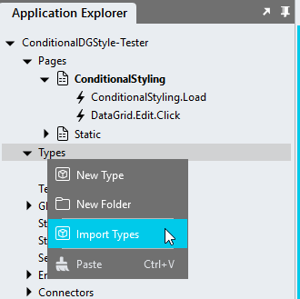

# Conditional Datagrid Styling <!-- omit in toc -->

Style datagrid rows or cells according to the values found in cells. The sample supports text, date, number and boolean columns. 

For styling simple enum columns, such as a `status` column, for example, consider using the [How-to: Styling Enum Column Values](https://github.com/stadium-software/howto-datagrid-enum-column-value-styling) module instead.

**NOTE**

Consider using the [Repeater Client-Side DataGrid](https://github.com/stadium-software/repeater-datagrid) in place of this module. *Repeater* controls are more extensible and easier to customise that DataGrids. 

https://github.com/stadium-software/conditional-datagrid-styling/assets/2085324/a9fa9c20-2816-4177-9433-2a3367ea69b0

## Contents
1. [Version](#version)
   1. [Change Log](#change-log)
2. [Setup](#setup)
   1. [Application Setup](#application-setup)
   2. [Global Script Setup](#global-script-setup)
   3. [Type Setup](#type-setup)
      1. [Manual Type Creation](#manual-type-creation)
      2. [Type Import](#type-import)
   4. [Page Setup](#page-setup)
   5. [Page.Load Setup](#pageload-setup)
3. [Supported Operators](#supported-operators)
4. [CSS](#css)
   1. [Styling DataGrids](#styling-datagrids)
5. [Known Issues](#known-issues)

# Version
2.3

## Change Log
2.0 all changes:
1. Consolidated scripts for all data types
2. Converted use of headers to DataGrid Columns Definition
3. Removed Link script (replaced by column classes property)
4. Changed conditions type 

2.1 Fixed "control in template" bug

2.1.1 Fixed "ID column is link" bug

2.1.2 Fixed "Logout error" bug

2.2 Fixed boolean conditions bug

2.3 Fixed "Selectable Data" bug

2.3.1 Removed sample dependency on connector

# Setup

## Application Setup
Check the *Enable Style Sheet* checkbox in the application properties


## Global Script Setup
1. Create a Global Script and name it "ConditionalColumnsStyling"
2. Add the input parameters below to the script
   1. Conditions
   2. DataGridClass
   3. IDColumn
3. Drag a Javascript action into the script and paste the Javascript below into the action
4. Do not make any changes to any of this script
```javascript
/* Stadium Script Version 2.3 - see https://github.com/stadium-software/conditional-datagrid-styling */
let data = ~.Parameters.Input.Conditions;
let classInput = ~.Parameters.Input.DataGridClass;
if (typeof classInput == "undefined") {
    console.error("The DataGridClass parameter is required");
    return false;
} 
let dgClassName = "." + classInput;
let idColumn = ~.Parameters.Input.IDColumn;
let scope = this;
let dg = document.querySelectorAll(dgClassName);
if (dg.length == 0) {
    console.error("The class '" + dgClassName + "' is not assigned to any DataGrid");
    return false;
} else if (dg.length > 1) {
    console.error("The class '" + dgClassName + "' is assigned to multiple DataGrids. DataGrids using this script must have unique classnames");
    return false;
} else { 
    dg = dg[0];
}
let datagridname = dg.id.split("_")[1].replace("-container","");
let dataGridColumns = getColumnDefinition();
if (!isNumber(idColumn)) {
    idColumn = dataGridColumns.map(function (e) {return e.name;}).indexOf(idColumn) + 1;
}
let table = dg.querySelector("table");
table.classList.add("datagrid-custom-column-styling");
for (let j = 0; j < data.length; j++) {
    let column = data[j].column;
    if (!isNumber(column)) {
        let columnNo = dataGridColumns.map(function (e) {return e.name;}).indexOf(column) + 1;
        data[j].column = columnNo;
    }
}
let classes = [];
for (let j = 0; j < data.length; j++) { 
    let c = data[j].cases;
    for (let i = 0; i < c.length; i++) { 
        if (getElementIndex(classes, c[i].class) == -1) classes.push(c[i].class);
    }
}
let selectorsList = '.' + classes.join(",.");
let options = {
    characterData: true,
    childList: true,
    subtree: true,
},
observer = new MutationObserver(styleRows);
styleRows();
observer.observe(table, options);
function styleRows() {
    observer.disconnect();
    removeAllClasses();
    let arrIDCells = table.querySelectorAll("tbody tr td:nth-child(" + idColumn + ")");
    for (let j = 0; j < arrIDCells.length; j++) {
        let row = arrIDCells[j].closest("tr");
        let IDcell = arrIDCells[j];
        if (IDcell.querySelector("button")) IDcell = IDcell.childNodes[0];
        let IDValue = Array.prototype.reduce.call(IDcell.childNodes, function(a, b) { return a + (b.nodeType === 3 ? b.textContent : ''); }, '');
        let rowData = getElementFromObjects(scope[`${datagridname}Data`], convertToNumber(IDValue), dataGridColumns[idColumn - 1].name);
        if (rowData) {
            for (let k = 0; k < data.length; k++) {
                let colValue = rowData[dataGridColumns[data[k].column - 1].name];
                let type = data[k].type;
                let cases = data[k].cases;
                for (let m = 0; m < cases.length; m++) {
                    let cellclass = cases[m].class;
                    let conditions = cases[m].conditions;
                    if (pass(colValue, conditions, type)) {
                        row.cells[data[k].column - 1].classList.add(cellclass);
                    }
                }
            }
        }
    }
    observer.observe(table, options);
}
function getColumnDefinition() {
    let cols = [];
    if (scope[`${datagridname}HasSelectableData`]) {
        cols.push({name:"RowSelector", headerText: "RowSelector"});
    }
    let colDefs = scope[`${datagridname}ColumnDefinitions`];
    for (let i=0;i<colDefs.length;i++) {
        cols.push(colDefs[i]);
    }
    return cols;
}
function getElementFromObjects(haystack, needle, column) {
    return haystack.find(obj => {return obj[column] == needle;});
}
function pass(value, conds, type) { 
    let passed = true;
    for (let i = 0; i < conds.length; i++) {
        let cond = "", arrCond, value2 = "";
        if (typeof conds[i] == 'string') {
            arrCond = conds[i].match(/==|>=|<=|>|<|!=/g);
            if (arrCond) cond = arrCond[0];
            value2 = conds[i].replace(cond, "");
        }
        let value1 = convertToNumber(value);
        if (type.toLowerCase() == 'date') {
            value1 = new Date(value1);
            value2 = new Date(value2);
        }
        if (type.toLowerCase() == 'number' || type.toLowerCase() == 'date') {
            if (cond == "==") {
                if ((value1 == value2) == false) passed = false;
            } else if (cond == "!=") {
                if ((value1 != value2) == false) passed = false;
            } else if (cond == ">=") {
                if ((value1 >= value2) == false) passed = false;
            } else if (cond == "<=") {
                if ((value1 <= value2) == false) passed = false;
            } else if (cond == "<") {
                if ((value1 < value2) == false) passed = false;
            } else if (cond == ">") {
                if ((value1 > value2) == false) passed = false;
            }
        } else if (type.toLowerCase() == 'boolean') {
            if (value1 != conds[i]) passed = false;
        } else {
            if (value1 != value2) passed = false;
        }
    }
    return passed;
}
function removeAllClasses() { 
    let arrClassCells = table.querySelectorAll(":is(" + selectorsList + ")");
    for (let i = 0; i < arrClassCells.length; i++) { 
        for (let j = 0; j < classes.length; j++) {
            arrClassCells[i].classList.remove(classes[j]);
        }
    }
}
function isNumber(str) {
    if (typeof str == "number") return true;
    return !isNaN(str) && !isNaN(parseFloat(str));
}
function convertToNumber(val) {
    if (!isNumber(val)) {
        let no;
        if (typeof val == "string") no = val.replace(/ /g,"");
        if (isNumber(no)) return Number(no);
    } else {
        val = Number(val);
    }
    return val;
}
function getElementIndex(haystack, needle) {
    return haystack.indexOf(needle);
}
```

## Type Setup
The type can create one nested type manually or use the import option to generate the type in two parts. How the type is used remains the same

### Manual Type Creation
1. Add a type called "ConditionalColumn" to the types collection in the Stadium Application Explorer
2. The type must have the following properties
   1. column (Any)
   2. type (Any)
   3. cases (List)
      1. Item (Object)
         1. class (Any)
         2. conditions (List)
            1. Item (Any)


### Type Import
1. Right-click on the `Types` node in the `Application Explorer`



2. In the `Import Type` popup
    1. Add "ConditionalColumn" into the `Name` input field
    2. Copy & paste the JSON below into the main input area

```json
{
 "column": "",
 "type": "",
 "cases": [{
  "class": "",
  "conditions": []
 }]
}
```


3. The type will be generated in two parts


## Page Setup
1. Add a *DataGrid* control to the page
2. Add a class to uniquely identify the *DataGrid* control to the control classes property (e.g. conditional-display)

## Page.Load Setup
1. Drag a *List* action into the event handler and call it "ConditionsList"
2. Assign the *ConditionalColumn* type to the *List* action
3. Define the columns to analyse
   1. *column*: the column name as defined in the *Column* property of the *DataGrid* or the column number
 
   2. *type*: the data type of the column for which you wish to analyse the data. The following are supported
      1. number
      2. date
      3. text
      4. boolean
   3. *cases*: a class and a list of conditions
      1. *class*: the name of the CSS class you wish to attach to cells that match all of the conditions
      2. *conditions*: a list of conditions to evaluate using the [supported operators](#supported-operators). The condition evaluates to *true* when **all** operators evaluate to *true*. Using unsupported operators will cause the condition to fail 
         1. Number conditions example: ">=8","<=11" (numbers from 8-11 match this condition)
         2. Date conditions example (note the date format and NO quotes around the date): "<2023-01-01" (dates before Jan first, 2023 match this condition)
         3. Text conditions example: For text no operator needs to be supplied. All supplied words will be checked using the == condition. Text input is case sensitive
         4. Boolean conditions example: For boolean columns the displayed valyes are 'Yes' and 'No', but the underlying values are 'true' and 'false'
4. Populate the *DataGrid* control with data by dragging on a query and assigning it using a *SetValue* (see [this repo](https://github.com/stadium-software/samples-database))

Fields Definition Example
```json
= [{
    "column": "NoOfChildren",
    "type": "Number",
    "cases": [{
        "class": "orange-bg",
        "conditions": [">8","<11"]
	}]
},{
    "column": "NoOfChildren",
    "type": "Number",
    "cases": [{
        "class": "orange-bg",
        "conditions": [">0","<3"]
    }]
},{
    "column": "StartDate",
    "type": "date",
    "cases": [{
        "class": "orange-bg",
        "conditions": ["<2023-01-01"]
	}]
},{
    "column": "Subscription",
    "type": "text",
    "cases": [{
        "class": "no_data",
        "conditions": ["No data"]
    },{
        "class": "subscribed",
        "conditions": ["Subscribed"]
    },{
        "class": "unsubscribed",
        "conditions": ["Unsubscribed"]
    }]
},{
    "column": "Healthy",
    "type": "boolean",
    "cases": [{
        "class": "healthy",
        "conditions": [true]
    }]
}]
```
5. Drag the "ConditionalColumnsStyling" global script below the *List*
6. Enter parameters for the script
   1. DataGridClass: The unique classname you assigned to the DataGrid above (e.g. conditional-display)
   3. Conditions: Select the List containing the conditions defined above from the dropdown
   4. IDColumn: The name of the column that contains the identifyer for this dataset as defined in the DataGrid Column property or the column number


# Supported Operators

<table>
<tr><th></th><th>Operator</th><th>Description</th></tr>
<tr><td>1.</td><td>==</td><td>equals</td></tr>
<tr><td>2.</td><td>!=</td><td>not equal</td></tr>
<tr><td>3.</td><td>></td><td>greater than</td></tr>
<tr><td>4.</td><td><</td><td>ess than </td></tr>
<tr><td>5.</td><td>>=</td><td>greater than or equal to</td></tr>
<tr><td>6.</td><td><=</td><td>less than or equal to</td></tr>
</table>

# CSS
When the script runs, it adds CSS the classes defined in the Conditions List above to the table cell (td) when **all** related conditions evaluate to true. See more CSS examples in the StyleSheet of the sample application 

## Styling DataGrids
1. Select the *StyleSheet* in the *Application Explorer*
2. Write CSS

**Styling the evaluated cells**
```css
.subscribed {
    background-color: rgba(12, 140, 200, .5);
    color: white;
}
.healthy {
    background-color: rgba(0, 77, 54, .5);
    color: white;
}
.green-bg {
    background-color: rgba(152, 237, 107, .5);
    color: black;
}
```

**Styling the row**
```css
tr:has(.no_data) td {
    background-color: rgba(12, 140, 200, .5);
}
```

**Styling other cells in the row**
Styling the first cell in the row where a class called "no_data" was applied to any cell
```css
tr:has(.no_data) td:nth-child(1) {
    background-color: rgba(12, 140, 200, .5);
}
```

**Manipulating other cells in a row**
The examples assume one of the cells has the class *no_data* and the **first column** has a **Click** event handler (td:nth-child(1))

Making a link look disabled
```css
tr:has(.no_data) td:nth-child(1) button {
    /*Disable the click event*/
    pointer-events: none;

    /*Make it gray*/
    color: grey;

    /*Remove the underline*/
    text-decoration: none;
}
```

Hiding the link and injecting text into the cell
```css
tr:has(.no_data) td:nth-child(1) button {
    /*Hide the link away*/
    display: none;
}
tr:has(.no_data) td:nth-child(1):after {
    /*Add any text into the cell or enter an HTML entity (try "\26D4" https://www.w3schools.com/cssref/css_entities.php)*/
    content: "Disabled";
}
```

# Known Issues
1. Using an underscore (_) in the page, template or control name causes the script to break