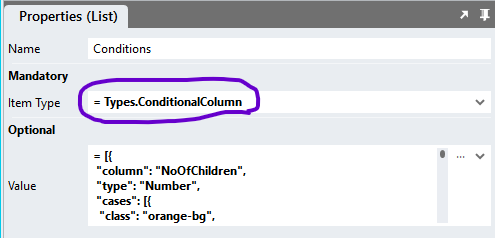

# Conditional Datagrid Styling <!-- omit in toc -->

Style datagrid rows or cells according to the values found in cells. The sample supports text, date, number and boolean columns. 

For styling simple enum columns, such as a `status` column, for example, consider using the [How-to: Styling Enum Column Values](https://github.com/stadium-software/howto-datagrid-enum-column-value-styling) module instead.

**NOTE**

Consider using the [Repeater Client-Side DataGrid](https://github.com/stadium-software/repeater-datagrid) in place of this module. *Repeater* controls are more extensible and easier to customise that DataGrids. 

## Contents
1. [Quickstart](#quickstart)
2. [Version](#version)
   1. [Change Log](#change-log)
3. [Setup](#setup)
   1. [Application Setup](#application-setup)
   2. [Global Script Setup](#global-script-setup)
   3. [Type Setup](#type-setup)
      1. [Type Import](#type-import)
      2. [Manual Type Creation](#manual-type-creation)
   4. [Page Setup](#page-setup)
   5. [Page.Load Setup](#pageload-setup)
   6. [Styling Cells and Rows](#styling-cells-and-rows)
4. [Upgrading Stadium Repos](#upgrading-stadium-repos)
5. [Known Issues](#known-issues)

https://github.com/stadium-software/conditional-datagrid-styling/assets/2085324/a9fa9c20-2816-4177-9433-2a3367ea69b0

# Quickstart
1. [Create Global Script](#global-script-setup)
2. [Add Types](#type-setup)
3. [Add Control to Page](#page-setup)
4. [Create Page.Load](#pageload-setup)

# Version
3.0

## Change Log
2.0 all changes:
1. Consolidated scripts for all data types
2. Converted use of headers to DataGrid Columns Definition
3. Removed Link script (replaced by column classes property)
4. Changed conditions type 

2.1 Fixed "control in template" bug

2.1.1 Fixed "ID column is link" bug

2.1.2 Fixed "Logout error" bug

2.2 Fixed boolean conditions bug

2.3 Fixed "Selectable Data" bug

2.3.1 Removed sample dependency on connector

3.0 Script performance optimisations

# Setup

## Application Setup
Check the *Enable Style Sheet* checkbox in the application properties


## Global Script Setup
1. Create a Global Script and name it "ConditionalColumnsStyling"
2. Add the input parameters below to the script
   1. Conditions
   2. DataGridClass
   3. IDColumn
3. Drag a Javascript action into the script and paste the Javascript below into the action
4. Do not make any changes to any of this script
```javascript
/* Stadium Script Version 3.0 - see https://github.com/stadium-software/conditional-datagrid-styling */
let conditions = ~.Parameters.Input.Conditions || [];
let classInput = ~.Parameters.Input.DataGridClass;
if (!classInput) {
    console.error("The DataGridClass parameter is required");
    return false;
}
let dgClassName = `.${classInput}`;
let scope = this;
let idColumn = ~.Parameters.Input.IDColumn;
let dg = document.querySelectorAll(dgClassName);
if (dg.length == 0) {
    console.error("The class '" + dgClassName + "' is not assigned to any DataGrid");
    return false;
} else if (dg.length > 1) {
    console.error("The class '" + dgClassName + "' is assigned to multiple DataGrids. DataGrids using this script must have unique classnames");
    return false;
}
dg = dg[0];
let datagridname = dg.id.split("_")[1].replace("-container","");
let table = dg.querySelector("table");
table.classList.add("datagrid-custom-column-styling");
const tbody = table.querySelector("tbody");
const classes = new Set(conditions.flatMap(condition => condition.cases?.map(c => c.class) || []));
let options = {characterData: true, childList: true, subtree: true, attributes: false};
let loadObserver = new MutationObserver(getDataGridData);
let changeObserver = new MutationObserver(addConditionsData);
let dataGridColumns = getColumnDefinition();
const columnIndexMap = new Map(dataGridColumns.map((col, idx) => [col, idx]));
let idColumnIndex = columnIndexMap.get(idColumn);
loadObserver.observe(table, options);
let data = [];
let dataLookup;
getDataGridData();
function getDataGridData() { 
    data = scope[`${datagridname}Data`];
    if (data) {
        loadObserver.disconnect();
        dataLookup = new Map(data.map(item => [String(item[idColumn]).trim(), item]));
        addConditionsData();
    }
}
function addConditionsData() {
    if (!compareSets(data, scope[`${datagridname}Data`])) getDataGridData();
    for (const row of data) {
        const classes = [];
        for (const cond of conditions || []) {
            const cases = Array.isArray(cond?.cases) ? cond.cases : [];
            for (const cs of cases) {
                if (pass(row?.[cond.column], cs.conditions, cond.type)) {
                    classes.push({ Column: cond.column, Class: cs.class });
                }
            }
        }
        row.ConditionalClasses = classes;
  }
  assignClasses(data);
}
function assignClasses() {
    if (!data?.length || idColumnIndex === undefined) return;
    removeAllClasses();
    const rows = tbody.querySelectorAll("tr");
    if (!rows.length) return;
    changeObserver.disconnect();
    const classUpdates = new Map();
    rows.forEach(row => {
        const cells = row.querySelectorAll("td");
        const idCell = cells[idColumnIndex];
        if (!idCell) return;
        const rowData = dataLookup.get(idCell.textContent.replace(/\s/g, ""));
        rowData?.ConditionalClasses?.forEach(({ Column, Class }) => {
            const columnIndex = columnIndexMap.get(Column);
            const cell = cells[columnIndex];
            if (cell) {
                if (!classUpdates.has(cell)) classUpdates.set(cell, []);
                classUpdates.get(cell).push(Class);
            }
        });
    });
    classUpdates.forEach((classes, cell) => {
        cell.classList.add(...classes);
    });
    changeObserver.observe(table, options);
}
function getColumnDefinition() {
    let cols = [];
    if (scope[`${datagridname}HasSelectableData`]) cols.push("StadiumRowSelector");
    const colDefs = scope[`${datagridname}ColumnDefinitions`] || [];
    return cols.concat(colDefs.map(col => col.name));
}
 function removeAllClasses() {
    const selector = [...classes].map(cls => `.${cls}`).join(',');
    table.querySelectorAll(selector).forEach(cell => {classes.forEach(cls => cell.classList.remove(cls));});
}
function pass(value, conds, type) { 
    if (!conds?.length) return true;
    let passed = true;
    const operators = {'==': (a, b) => a == b,'!=': (a, b) => a != b,'>=': (a, b) => a >= b,'<=': (a, b) => a <= b,'<': (a, b) => a < b,'>': (a, b) => a > b};
    const CONDITION_REGEX = /==|>=|<=|>|<|!=/g;
    for (let i = 0; i < conds.length; i++) {
        let cond = "", arrCond, value2 = "";
        if (typeof conds[i] == 'string') {
            arrCond = conds[i].match(CONDITION_REGEX);
            if (arrCond) cond = arrCond[0];
            value2 = conds[i].replace(cond, "");
        }
        let value1 = convertToNumber(value);
        if (type.toLowerCase() == 'date') {
            value1 = new Date(value1);
            value2 = new Date(value2);
        }
        if (type.toLowerCase() == 'number' || type.toLowerCase() == 'date') {
        if (!operators[cond](value1, value2)) passed = false;
        } else if (type.toLowerCase() == 'boolean') {
            if (value1 != conds[i]) passed = false;
        } else {
            if (value1 != value2) passed = false;
        }
    }
    return passed;
}
function convertToNumber(val) {
    if (typeof val === "number") return val;
    if (typeof val === "string") {
        const cleaned = val.replace(/\s/g, "");
        return isNumber(cleaned) ? Number(cleaned) : val;
    }
    return val;
}
function isNumber(str) {
    if (typeof str == "number") return true;
    return !isNaN(str) && !isNaN(parseFloat(str));
}
function compareSets(set1, set2) {
    if (set1.length !== set2.length || set1[0] !== set2[0]) return false;
    const ids1 = set1.map(a => a[idColumn]).sort();
    const ids2 = set2.map(a => a[idColumn]).sort();
    return JSON.stringify(ids1) === JSON.stringify(ids2);
}
```

## Type Setup
The type can create one nested type manually or use the import option to generate the type in two parts. How the type is used remains the same

### Type Import
1. Right-click on the `Types` node in the `Application Explorer`


2. In the `Import Type` popup
    1. Add "ConditionalColumn" into the `Name` input field
    2. Copy & paste the JSON below into the main input area

```json
{
 "column": "",
 "type": "",
 "cases": [{
  "class": "",
  "conditions": []
 }]
}
```


3. The type will be generated in two parts


### Manual Type Creation
1. Add a type called "ConditionalColumn" to the types collection in the Stadium Application Explorer
2. The type must have the following properties
   1. column (Any)
   2. type (Any)
   3. cases (List)
      1. Item (Object)
         1. class (Any)
         2. conditions (List)
            1. Item (Any)


## Page Setup
1. Add a *DataGrid* control to the page
2. Add a class to uniquely identify the *DataGrid* control to the control classes property (e.g. conditional-display)


## Page.Load Setup
1. Populate the *DataGrid* control with data
2. Drag a *List* action into the event handler and call it "ConditionsList"
3. Assign the *ConditionalColumn* type to the *List* action



4. Define the columns to analyse in the List `Value` property
   1. *column*: the column name as defined in the *Column* property of the *DataGrid* or the column number

 

   2. *type*: the data type of the column for which you wish to analyse the data. The following are supported
      1. number
      2. date
      3. text
      4. boolean
   3. *cases*: a class and a list of conditions
      1. *class*: the name of the [CSS class](#styling-cells-and-rows) you wish to attach to cells that match all of the conditions
      2. *conditions*: a list of conditions to evaluate using the [supported operators](#supported-operators). The condition evaluates to *true* when **all** operators evaluate to *true*. Using unsupported operators will cause the condition to fail 

<table>
<tr><th>Type</th><th>Example1</th><th>Example2</th></tr>
<tr><td>Number</td><td>[">=8","<=11"]</td><td>["==3"]</td></tr>
<tr><td>Date</td><td>[">2023-01-01", "<2024-01-01"]</td><td>[">=2023-01-01"]</td></tr>
<tr><td>Text</td><td>["Subscribed"]</td><td>["Subscribed", "Unsubscribed"]</td></tr>
<tr><td>Boolean</td><td>[true]</td><td>[false]</td></tr>
</table>

4. Supported Operators

<table>
<tr><th>Operator</th><th>Description</th></tr>
<tr><td>==</td><td>equals</td></tr>
<tr><td>!=</td><td>not equal</td></tr>
<tr><td>></td><td>greater than</td></tr>
<tr><td><</td><td>ess than </td></tr>
<tr><td>>=</td><td>greater than or equal to</td></tr>
<tr><td><=</td><td>less than or equal to</td></tr>
</table>

**Fields Definition Example**
```json
[{
    "column": "NoOfChildren",
    "type": "Number",
    "cases": [{
        "class": "orange-bg",
        "conditions": [">8","<11"]
	}]
},{
    "column": "NoOfChildren",
    "type": "Number",
    "cases": [{
        "class": "orange-bg",
        "conditions": ["==3"]
    }]
},{
    "column": "StartDate",
    "type": "date",
    "cases": [{
        "class": "orange-bg",
        "conditions": ["<2023-01-01"]
	}]
},{
    "column": "Subscription",
    "type": "text",
    "cases": [{
        "class": "no_data",
        "conditions": ["No data"]
    },{
        "class": "subscribed",
        "conditions": ["Subscribed"]
    },{
        "class": "unsubscribed",
        "conditions": ["Unsubscribed"]
    }]
},{
    "column": "Healthy",
    "type": "boolean",
    "cases": [{
        "class": "healthy",
        "conditions": [true]
    }]
}]
```

5. Drag the "ConditionalColumnsStyling" global script below the *List*
6. Enter parameters for the script
   1. DataGridClass: The unique classname you assigned to the DataGrid above (e.g. conditional-display)
   3. Conditions: Select the List containing the conditions defined above from the dropdown
   4. IDColumn: The name of the column that contains the identifier for this dataset as defined in the DataGrid Column property or the column number


## Styling Cells and Rows
1. Select the *StyleSheet* in the *Application Explorer*
2. Write CSS

**Styling the evaluated cells**
```css
.subscribed {
    background-color: rgba(12, 140, 200, .5);
    color: white;
}
.healthy {
    background-color: rgba(0, 77, 54, .5);
    color: white;
}
.green-bg {
    background-color: rgba(152, 237, 107, .5);
    color: black;
}
```

**Styling the row**
```css
tr:has(.no_data) td {
    background-color: rgba(12, 140, 200, .5);
}
```

**Styling other cells in the row**

Styling the first cell in the row where a class called "no_data" was applied to any cell
```css
tr:has(.no_data) td:nth-child(1) {
    background-color: rgba(12, 140, 200, .5);
}
```

**Manipulating other cells in a row**

The examples assume one of the cells has the class *no_data* and the **first column** has a **Click** event handler (td:nth-child(1))

Making a link look disabled
```css
tr:has(.no_data) td:nth-child(1) button {
    /*Disable the click event*/
    pointer-events: none;

    /*Make it gray*/
    color: grey;

    /*Remove the underline*/
    text-decoration: none;
}
```

Hiding the link and injecting text into the cell
```css
tr:has(.no_data) td:nth-child(1) button {
    /*Hide the link away*/
    display: none;
}
tr:has(.no_data) td:nth-child(1):after {
    /*Add any text into the cell or enter an HTML entity (try "\26D4" https://www.w3schools.com/cssref/css_entities.php)*/
    content: "Disabled";
}
```
# Upgrading Stadium Repos
Stadium Repos are not static. They change as additional features are added and bugs are fixed. Using the right method to work with Stadium Repos allows for upgrading them in a controlled manner. 

How to use and update application repos is described here: [Working with Stadium Repos](https://github.com/stadium-software/samples-upgrading)

# Known Issues
1. Using an underscore (_) in the page, template or control name causes the script to break